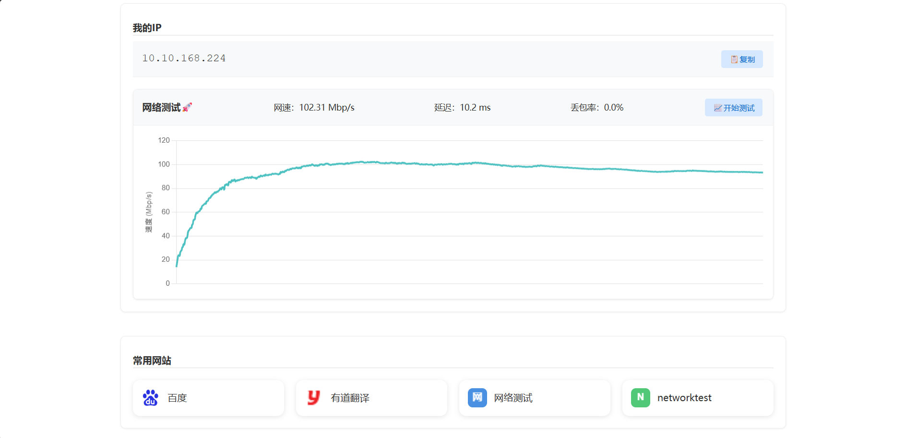

## 📄 项目简介：

> 这是一个仅300K **轻量、高效、可视化的网络测速工具**，采用现代 Web 技术栈构建，能够快速准确地测试网络速度、延迟和丢包率，具备良好的可维护性和可扩展性，非常适合用于个人、企业或服务提供商的网络性能评估。

1. **下载速度测试**：通过下载固定文件实时计算当前网络的 Mbps 下载速度。
2. **延迟测试（Ping）**：通过 HTTP 请求测量服务器响应时间（ms）。
3. **丢包率测试**：发送多个请求并统计失败比例，模拟丢包率。
4. **图表展示**：使用 Chart.js 动态绘制下载速度变化曲线，支持响应式布局。

适用于本地部署、企业内网、宽带运营商等场景下的网络质量检测。

---

## 部署

克隆项目文件到目录后直接使用编写好的 `nginx.conf` 配置文件运行即可

## ⚙️ 使用到的技术点及特点：

| 技术/工具 | 描述 | 特点 |
|----------|------|------|
| **HTML5** | 构建页面结构和 `<canvas>` 图表容器 | 简洁、标准化、跨平台兼容性好 |
| **CSS3** | 页面样式美化与响应式布局 | 支持 `aspect-ratio` 实现宽高比控制，提升用户体验 |
| **JavaScript (ES6+)** | 主要逻辑实现语言，处理异步请求、状态更新等 | 原生 JS 开发，无需框架依赖，轻量高效 |
| **Chart.js** | 绘制动态折线图，展示下载速度趋势 | 轻量、易用、支持响应式图表，视觉直观 |
| **Fetch API** | 发送 HTTP 请求获取测试数据 | 原生浏览器支持，简洁高效的异步通信方式 |
| **setInterval / Promise.all** | 控制丢包率测试频率或并发执行 | 提供灵活测试策略，支持快速测试 |
| **DOM 操作** | 更新页面元素内容（如最大速度、延迟、丢包率） | 直接操作 DOM，实时反馈测试结果 |
| **响应式设计** | 使用 CSS 和 Chart.js 配置实现自适应布局 | 自动适配不同屏幕尺寸，适合多设备访问 |

---

## ✅ 项目优势：

| 优势点 | 说明 |
|--------|------|
| **轻量无依赖** | 不依赖任何前端框架（如 Vue、React），原生 JS + HTML + CSS 即可运行 |
| **实时性强** | 利用流式读取（ReadableStream）实时更新下载速度，体验流畅 |
| **可视化直观** | 使用 Chart.js 动态显示速度曲线，用户更容易理解网络波动情况 |
| **模块化设计** | 各项测试功能独立封装，便于维护和扩展 |
| **易于部署** | 只需一个静态服务器即可运行|
| **可定制性强** | 可自由修改测试逻辑、图表样式、单位（MB/s ↔ Mbps）、UI 主题等 |
| **响应式布局** | 图表自动适配屏幕宽度，保持美观比例 |

